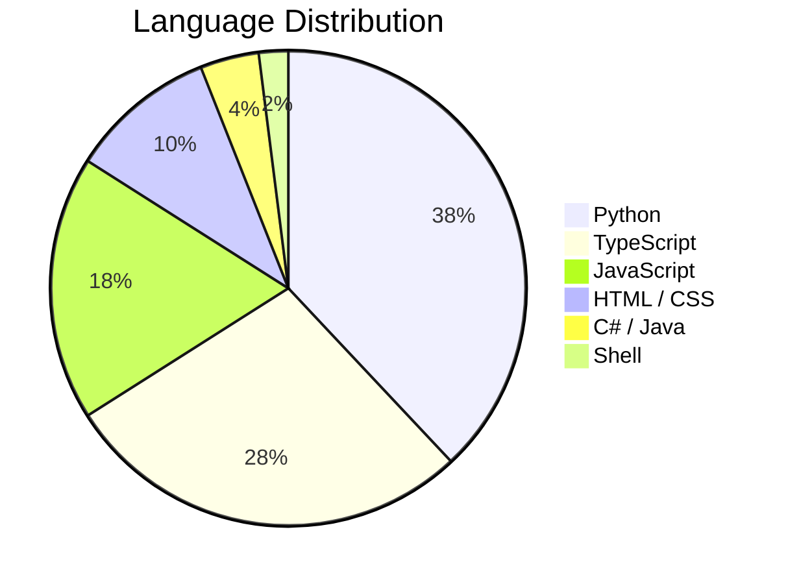
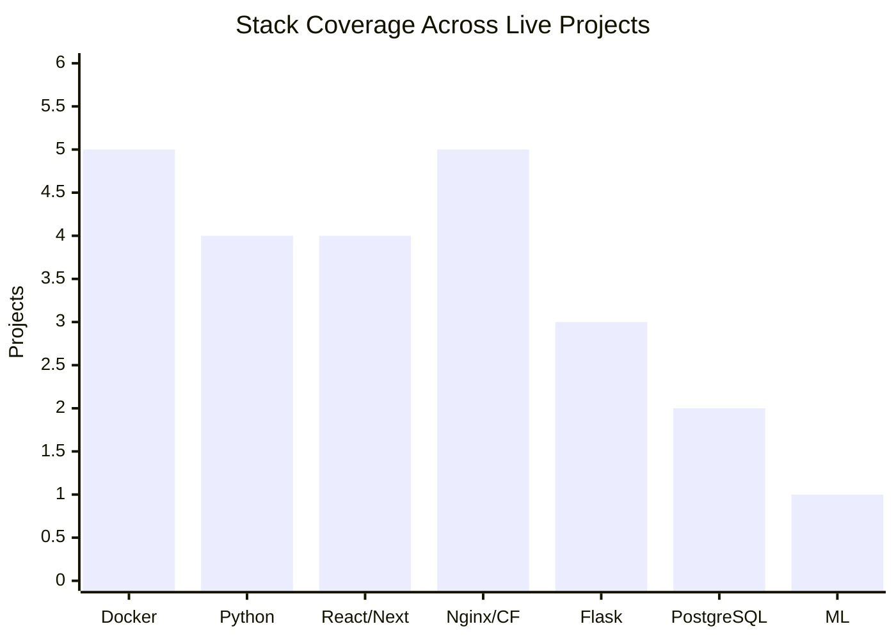

<div align="center">

# Emmanuel Kiprono

**Full-Stack Developer · Zanah Technology · Nairobi, Kenya**

[](https://zanah.co.ke)
[](https://github.com/ekck)
[](https://twitter.com/Manu_buda)

</div>

---

I build data-driven web applications for East African markets — news aggregators, financial dashboards, public procurement trackers, and ML-powered tools. Everything runs self-hosted on a hardened Ubuntu VPS behind Cloudflare, from schema to Nginx config.

---

## Projects

| Project | Stack | Description |
|---|---|---|
| **[TenderWatch](https://zanah.co.ke)** | Next.js · Flask · PostgreSQL · Docker | Kenya public procurement tracker with PPRA scraper and county-level analytics |
| **[CoinBrief](https://coinbrief.zanah.co.ke)** | Next.js · CoinGecko · Docker | Crypto news and real-time market data for East Africa |
| **[The Chronicle](https://thechronicle.zanah.co.ke)** | Flask · React · Webz.io · Docker | News aggregation with sentiment analysis and topic filtering |
| **[Isotope Consultants](https://isotope.zanah.co.ke)** | React · Python · Docker · Nginx | Corporate site on a containerised React/Flask stack with SSL and Cloudflare |
| **Football Predictor** | Python · Streamlit · Scikit-learn | ML match predictions with configurable form windows and Kelly Criterion staking |

---

## Stack

**Frontend**


**Backend**


**Data & ML**


**Infrastructure**


---

## GitHub Stats

<div align="center">


&nbsp;&nbsp;


</div>

---

## Visualisations

**Language distribution**



**Tech stack — live projects using each tool**



**Live projects in production — growth over time**

```mermaid
xychart-beta
    title "Production Projects"
    x-axis ["2022", "2023", "2024", "2025"]
    y-axis "Projects" 0 --> 6
    line [2, 3, 4, 5]
```

---

## Currently Exploring

- **PACE / TerraQuant** — Pan-African Carbon Exchange on Polygon, Kenya 2023 regulatory compliance
- **Time series foundation models** — zero-shot forecasting for East African agricultural, energy, and financial data
- **Hymn book digitisation** — structured JSON database of Kiswahili, English, Kikuyu, and Kimeru collections
- **EA web portfolio** — AgriPulse (crop prices), MadraSA (KCSE tracker), PowerGrid KE (KPLC load shedding)

---

<div align="center">

[zanah.co.ke](https://zanah.co.ke) · [@ekck](https://github.com/ekck) · [@Manu_buda](https://twitter.com/Manu_buda)

</div>
